# From 914 to 1585 TFLOPS: Building an MXFP8 Grouped GEMM on AMD MI355X

*A standalone Triton kernel for the Llama4 MoE forward (and dgrad) pass on
gfx950 / CDNA4 — built from a naive baseline, then optimized one measurable rung
at a time.*

---

## TL;DR

We start with a **correct but naive** MXFP8 grouped GEMM that sustains only
**914 TFLOPS**, then climb a ladder of optimizations, measuring throughput at
each step on an MI355X. We end at **1585 TFLOPS geomean — 1.74× the naive
kernel** — on a representative set of Llama4 shapes (peak ~1910 TFLOPS), holding
**27.6 dB SQNR** the whole way.

The single dominant win is AMD-specific: a **CDNA4-native scale layout** that
removes a per-K-iteration address-shuffle the compiler would otherwise emit on
the MFMA scale loads. That one rung is worth **+48% throughput** (993 → 1473
TFLOPS).

Every number below is reproducible: `blog/ladder.py` is one parameterized kernel
with a `rung` knob (0–5), and `blog/bench_ladder.py` runs the sweep one-shape-
per-GPU and writes `blog/ladder_results.json`.

| Rung | What it adds | Geomean TFLOPS | × naive |
|---|---|--:|--:|
| L0 | naive baseline | 914 | 1.00× |
| L1 | + sync-free routing | 1040 | 1.14× |
| L2 | + bigger tiles & pipeline | 954 | 1.04× |
| L3 | + GROUP_M / XCD scheduling | 993 | 1.09× |
| **L4** | **+ CDNA4-native scale layout** | **1473** | **1.61×** |
| L5 | + per-shape autotuning | **1585** | **1.74×** |

(Throughput is `2·M·N·K / time`; since FLOPs are fixed per shape, the `× naive`
column is just the runtime improvement.)

> Diagrams are SVGs rendered from editable Excalidraw scenes
> (`blog/NN-*.excalidraw`); regenerate with `python blog/gen_diagrams.py`.

---

## 1. What is a grouped GEMM?

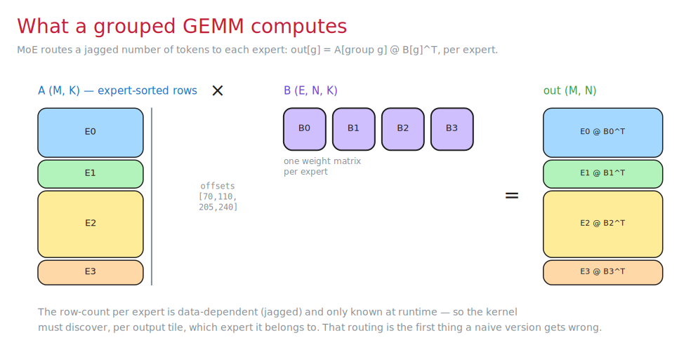

A Mixture-of-Experts layer routes a **jagged**, data-dependent number of tokens
to each of `E` experts. So the core op isn't one matmul — it's `E` of them, each
a different-height slice of the activation matrix `A` times that expert's weight
matrix `B[g]`:

```
out[s_g : e_g]  =  A[s_g : e_g]  @  B[g]^T      for each expert g
```

The per-expert row counts are only known at runtime, passed as
`group_end_offsets` (cumulative token counts). The kernel's first job — before
any math — is to figure out, for each output tile, **which expert it belongs
to**. Getting that routing cheap is the whole first half of the battle; the
second half is feeding AMD's matrix units efficiently.

This same `A @ B^T` kernel serves both the MoE **forward** pass and the **dgrad**
(input-gradient) pass.

---

## 2. What is MXFP8?

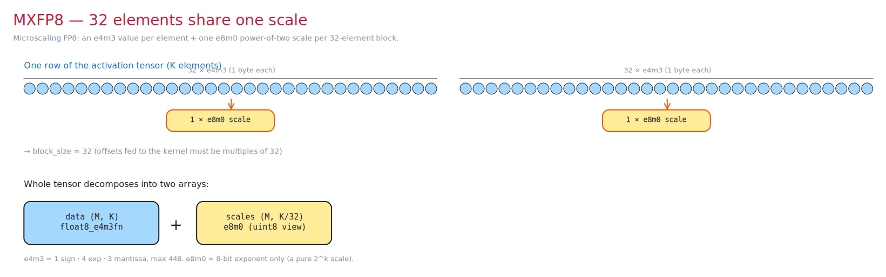

MXFP8 is an OCP **microscaling** format. Instead of one scale for a whole tensor
(tensorwise) or per row (rowwise), it uses **one scale per contiguous block of 32
elements**:

- **Data**: each element is `float8_e4m3fn` — 1 sign, 4 exponent, 3 mantissa
  bits, max magnitude **448**.
- **Scale**: each 32-element block carries one **e8m0** byte — a pure 8-bit
  exponent, i.e. a power-of-two scale `2^k`. No mantissa, no sign.

So a `(M, K)` activation tensor becomes a `(M, K)` fp8 data array plus a
`(M, K/32)` scale array. Because the block size is 32, the per-expert offsets fed
to the kernel must be multiples of 32.

The fine granularity is what buys MXFP8 its accuracy: a single outlier only
inflates the scale of its own 32-wide block, not the whole row or tensor.

---

## 3. How the scale is computed

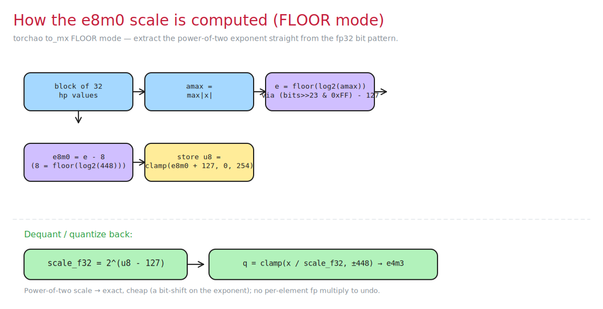

We match torchao's **FLOOR** scaling mode (`to_mx`). For each 32-element block:

1. `amax = max(|x|)` over the block.
2. Extract the floor-log2 exponent **straight from the fp32 bit pattern** —
   no `log`: `e = ((bits >> 23) & 0xFF) - 127`.
3. Subtract the e4m3 headroom: `e8m0_unbiased = e - 8`, where
   `8 = floor(log2(448))` is the largest power of two e4m3 can represent.
4. Store the biased byte: `u8 = clamp(e8m0_unbiased + 127, 0, 254)`.

To quantize, dequantize, and feed the MFMA, the scale is just
`scale_f32 = 2^(u8 - 127)`, and `q = clamp(x / scale_f32, ±448)` cast to e4m3.
Because the scale is always a power of two, applying or undoing it is exact and
cheap — a bit-shift on the exponent, not a floating-point multiply. That's the
property the CDNA4 MFMA scale instruction is built around, and it's central to
the L4 optimization.

---

## 4. How the matrix engine consumes MXFP8

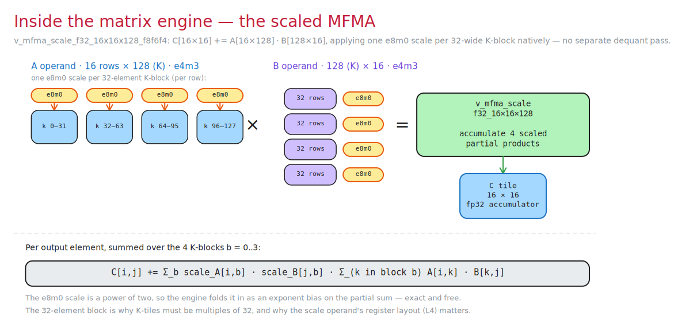

On CDNA4 (gfx950 / MI350+), `tl.dot_scaled` lowers to one matrix instruction:
`v_mfma_scale_f32_16x16x128_f8f6f4`. It computes a `16×16` fp32 tile of `C` from
a `16×128` tile of `A` and a `128×16` tile of `B`, both in `e4m3` — and crucially
it takes the **e8m0 scales as a native operand**.

The `128`-wide contraction is split into **four 32-element K-blocks**, and each
block carries its own e8m0 scale on both operands. The engine accumulates, per
output element:

```
C[i,j] += Σ_b  scale_A[i,b] · scale_B[j,b] · Σ_(k in block b) A[i,k]·B[k,j]
```

There is **no separate dequantization pass**: because the scale is a power of
two, the hardware folds it in as an exponent bias on the partial sum — exact and
free. This is the whole reason MXFP8 is fast here. (It's also why every K-tile
must be a **multiple of 32** — the block boundary is baked into the instruction.)

But the scales are now a *register operand*, not just data in memory, and two
things about feeding them matter enormously:

1. **The scale operand layout.** The MFMA wants its scales in a specific
   swizzled register order. Hand it the natural row-major `(M, K/32)` layout and
   the Triton lowering inserts an address-shuffle chain (`ds_read_u8` +
   `v_perm_b32`) on **every K iteration** — dead weight in the hottest loop.
2. **The 8-XCD topology.** An MI355X is eight accelerator complex dies, each with
   its own L2 slice. Scheduling that ignores XCD boundaries throws away locality.

The rest of the post builds a kernel that gets both right. We measure each step
by its sustained **MXFP8 throughput (TFLOPS)** on six representative Llama4
shapes spanning the regimes (small/large K, 1–8 experts).

---

## 5. The naive baseline (L0) — 914 TFLOPS

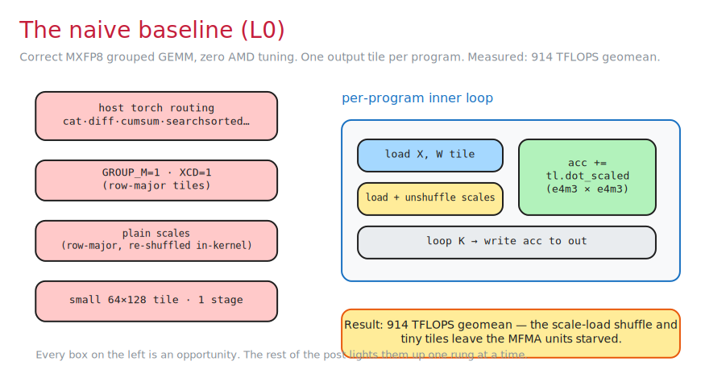

The naive kernel is *correct* and does the obvious thing:

- routing metadata built on the host with a chain of torch ops,
- one output tile per program, row-major (`GROUP_M=1`, no XCD swizzle),
- plain row-major scales (re-shuffled inside the kernel by the lowering),
- a small `64×128` tile, single-stage (no software pipelining).

Measured geomean: **914 TFLOPS** — for reference that's *below* the bf16 baseline
on most shapes. The MFMA units are starved: tiny tiles give poor arithmetic
intensity, and the scale-load shuffle eats the inner loop. Every design choice
above is a rung to climb.

---

## 6. L1 — Sync-free routing (914 → 1040 TFLOPS, +14%)

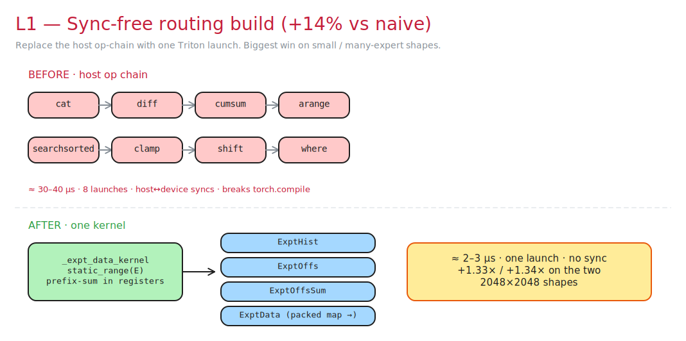

The host-side routing is a chain of `cat → diff → cumsum → arange →
searchsorted → clamp → shift → where`: ~8 kernel launches and host↔device syncs,
roughly **30–40 µs** of overhead that also breaks `torch.compile` graphs.

We replace the whole chain with **one** Triton kernel (`_expt_data_kernel`,
`num_warps=1`) that walks the experts in a `tl.static_range`, keeps a running
prefix-sum in registers, and writes every routing tensor in one pass (~2–3 µs, no
sync). The key output is a **packed map**: one `int32` per tile encoding both the
expert and the row-block.

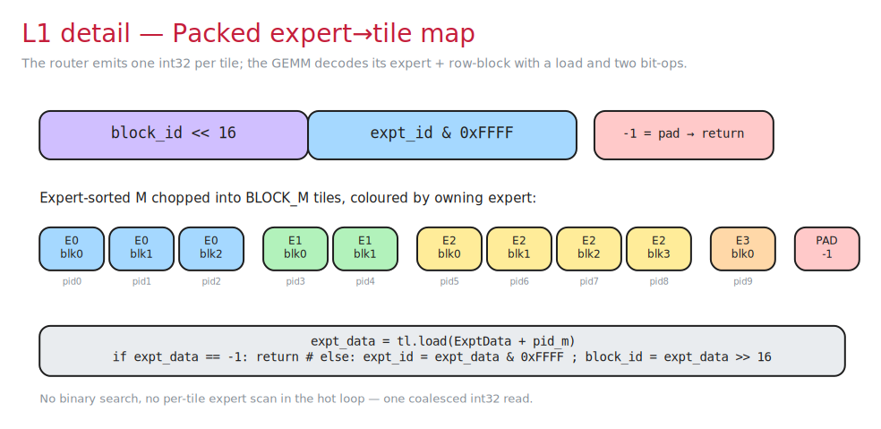

```python
expt_data = tl.load(ExptData + pid_m)
if expt_data == -1:        # padding tile from BLOCK_M round-up → bail
    return
expt_id  = expt_data & 0x0000FFFF
block_id = expt_data >> 16
```

No binary search, no per-tile expert scan in the hot path. The win is largest
where the kernel is short and the fixed routing cost dominates: `(8, 2048, 2048)`
goes **713 → 946 TFLOPS (+33%)** and `(1, 2048, 2048)` **752 → 1012 TFLOPS
(+35%)**; on big shapes it's amortized to ~2%.

---

## 7. L2 — Bigger tiles + software pipeline (and why it's a wash)

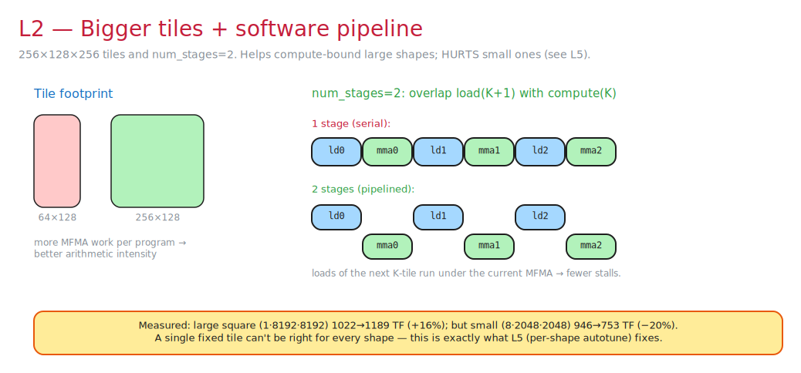

Bumping to `256×128×256` tiles with `num_stages=2` gives each program much more
MFMA work and lets the loads of the next K-tile overlap the current MFMA.

On compute-bound large shapes this helps: `(1, 8192, 8192)` goes
**1046 → 1189 TFLOPS (+14%)**. But on small shapes the same fixed tile *hurts* —
`(8, 2048, 2048)` drops **946 → 753 TFLOPS (−20%)**, because a 256-row tile is
mostly wasted on a short expert. The geomean actually slips: **1040 → 954
TFLOPS**.

This is the honest lesson of the ladder: **no single config wins everywhere.**
That tension is exactly what L5 (autotuning) resolves.

---

## 8. L3 — GROUP_M + XCD scheduling (954 → 993 TFLOPS)

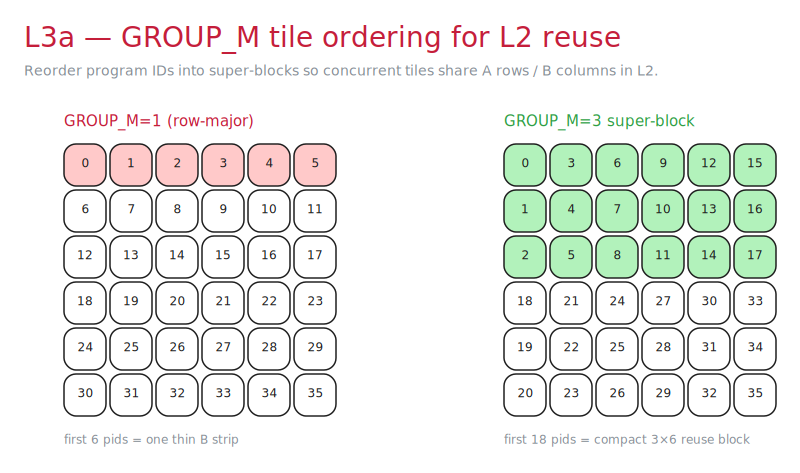

`GROUP_M` reorders program IDs into super-blocks traversed column-first, so the
tiles running concurrently re-hit the same A rows and B columns out of L2 instead
of sweeping a thin strip and thrashing.

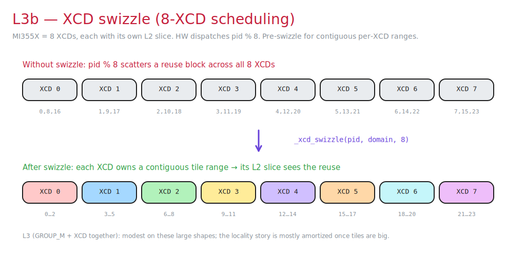

But the hardware dispatches workgroups round-robin across the 8 XCDs
(`pid % 8`), which would scatter that reuse block across all eight L2 slices.
`_xcd_swizzle` pre-permutes the pid so each XCD instead owns a *contiguous* tile
range, keeping the reuse inside one L2.

This trio is adapted from AMD aiter's `moe_op_gemm_a8w8` (itself from
triton-lang's `matmul_ogs`). On these large, already compute-bound shapes the
locality is mostly amortized, so L3 is modest: **954 → 993 TFLOPS**. (It's a
bigger deal on small/many-expert shapes, and — notably — it *regresses* the wgrad
kernel, which is operand-latency-bound, so we don't use it there.)

---

## 9. L4 — CDNA4-native scale layout (the big win): 993 → 1473 TFLOPS

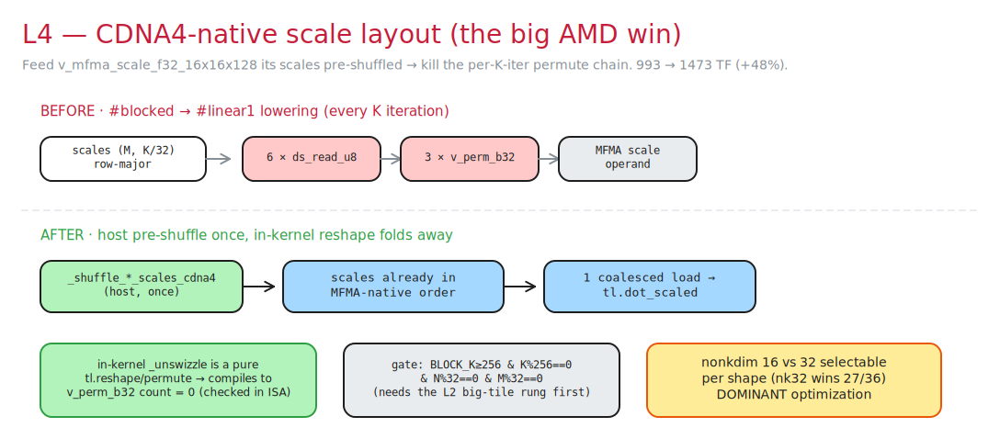

Here's the payoff. With plain row-major scales, the `#blocked → #linear1`
lowering emits, **on every K iteration**, roughly `6× ds_read_u8 + 3×
v_perm_b32` per scale tensor just to shuffle the e8m0 bytes into the order the
MFMA wants.

We pre-shuffle the scales **once, host-side** into the MFMA-native layout. The
in-kernel `_unswizzle_*_cdna4` then becomes a pure `tl.reshape`/`tl.permute` on
registers that the compiler folds away — we confirmed **`v_perm_b32` count = 0**
in the AMDGCN.

The effect is dramatic and universal: **+48% throughput**, 993 → 1473 TFLOPS
geomean, e.g. `(1, 8192, 8192)` jumps **1132 → 1910 TFLOPS**. This is the rung
that makes MXFP8 worth it on CDNA4.

A couple of details:
- **Gate:** needs `BLOCK_K ≥ 256 & K%256==0 & N%32==0 & M%32==0` — which is why
  the big-tile rung (L2) has to come first.
- **`nonkdim` 16 vs 32:** two shuffle formulas; nk32 wins 27/36 of the full
  Llama4 set, selected per shape in L5.

The inner loop itself stays lean: scales ride straight into the MFMA (no separate
dequantize pass), and the ragged K tail is peeled so the steady-state loop is
branch-free.

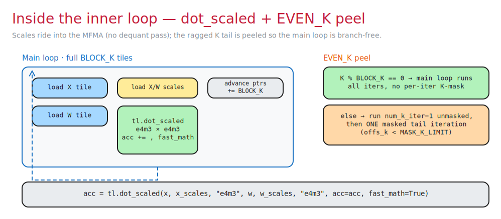

---

## 10. The ladder so far

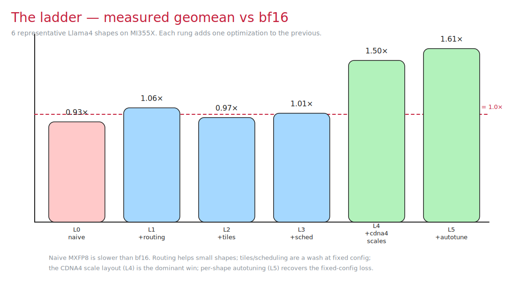

Plotting the cumulative geomean throughput makes the story obvious: routing is a
cheap win, tiles/scheduling are a wash at a *fixed* config, and the CDNA4 scale
layout is the dominant lever. One thing remains — recovering the per-shape config
loss we saw at L2.

---

## 11. L5 — Per-shape autotuning → 1585 TFLOPS

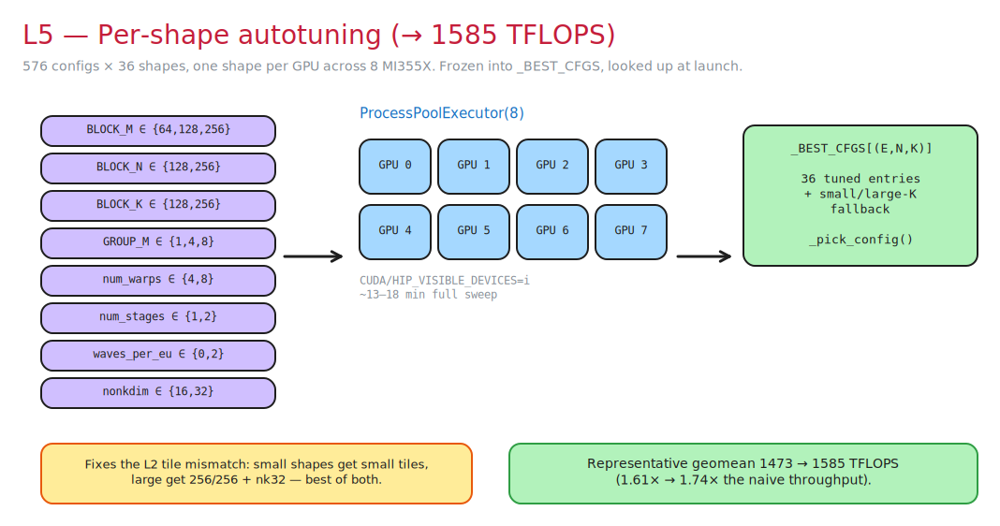

We swept a **576-config** space per shape:

```
BLOCK_M ∈ {64,128,256}   BLOCK_N ∈ {128,256}   BLOCK_K ∈ {128,256}
GROUP_M ∈ {1,4,8}        num_warps ∈ {4,8}      num_stages ∈ {1,2}
waves_per_eu ∈ {0,2}     matrix_instr_nonkdim ∈ {16,32}
```

across all 36 Llama4 shapes, dispatched **one shape per GPU** across 8 MI355X
(`ProcessPoolExecutor(8)`, each worker pinned via `CUDA/HIP_VISIBLE_DEVICES`).
A full sweep takes ~13–18 min. Winners freeze into a `_BEST_CFGS[(E,N,K)]` table
consulted at launch by `_pick_config`, with a small/large-K fallback for unseen
shapes, plus a few per-shape cache hints (`evict_first` on X, `.cg` on W).

This fixes the L2 mismatch — small shapes get small tiles, large shapes get
`256/256` + nk32 — and lifts the geomean **1473 → 1585 TFLOPS** (1.74× the naive
kernel).

---

## 12. Per-shape throughput (TFLOPS at each rung)

MI355X, M=16640:

| E · N · K | L0 | L1 | L2 | L3 | L4 | **L5** |
|---|--:|--:|--:|--:|--:|--:|
| 8 · 2048 · 2048 | 713 | 946 | 753 | 826 | 1092 | **1267** |
| 1 · 2048 · 2048 | 752 | 1012 | 795 | 952 | 1152 | **1421** |
| 2 · 8192 · 2048 | 1091 | 1189 | 983 | 1049 | 1472 | **1567** |
| 4 · 5120 · 5120 | 981 | 1036 | 1031 | 1002 | 1668 | **1704** |
| 8 · 5120 · 8192 | 992 | 1027 | 1047 | 1026 | 1730 | **1727** |
| 1 · 8192 · 8192 | 1022 | 1046 | 1189 | 1132 | 1910 | **1911** |
| **geomean** | **914** | **1040** | **954** | **993** | **1473** | **1585** |

SQNR is 27.6 dB at every rung and every shape — the optimizations are pure
scheduling/layout, never accuracy trades.

> Six-shape representative subset chosen to span the regimes. As a sanity check
> against bf16, the full 36-shape production geomean speedup (in `bench.py`) is
> ≈ **1.49× over `torch._grouped_mm`** at ~1591 geomean TFLOPS.

---

## 13. Takeaways

- **The CDNA4-native scale layout dominates** — +48% throughput in one rung.
  Everything else is single-digit to low-double-digit percent.
- **Fixed configs can't win everywhere** — the L2 throughput regression is real,
  and the reason per-shape autotuning exists.
- **Routing overhead is shape-sensitive**: +33–35% TFLOPS for small/many-expert
  kernels, ~2% for large ones.
- **Order matters**: the scale layout needs `BLOCK_K ≥ 256`, so the big-tile rung
  must land first to unlock it.

### What didn't help (bounding the ceiling)

| Lever | Result | Why |
|---|---|---|
| `num_stages=3` on K=2048 | −7% TF | K-loop too short; fill/drain + LDS occupancy cost |
| `N,K` as `tl.constexpr` | −25% TF | worse codegen with literal large ints |
| `kpack=2` | no-op | Triton-AMD forces 1 on gfx950 |
| XCD/GROUP_M ported to wgrad | −50% TF | wgrad is operand-latency-bound, not schedule-bound |

The remaining headroom to hipBLASLt's rowwise/tensorwise FP8 is the per-32-block
scale-load cost in the inner loop plus an `s_waitcnt` conservatism in our Triton
build. Next: cherry-pick the token-aware wait-count fix, and a raw-intrinsic
(FlyDSL) path for the long-term ceiling.

---

## Reproduce

```bash
source /it-share/shekhar/mxfp8/.venv/bin/activate
cd /it-share/shekhar/grouped-gemms

python test_correctness.py        # SQNR vs torch._grouped_mm, 27 dB threshold
python bench.py                   # full 36-shape Llama4 sweep + geomean TFLOPS

python blog/bench_ladder.py       # the naive→optimized ladder (this post)
python blog/gen_diagrams.py       # regenerate the diagrams
```

`blog/ladder.py` is the parameterized kernel (`rung` 0–5) used here; it reuses
the production Triton kernel and host shuffles from `kernels/forward.py`
verbatim, so the measured deltas reflect real kernel behavior.

*Hardware: 8× AMD MI355X (gfx950). Software: PyTorch 2.13 nightly (rocm7.1) ·
triton-rocm 3.7.0.*
